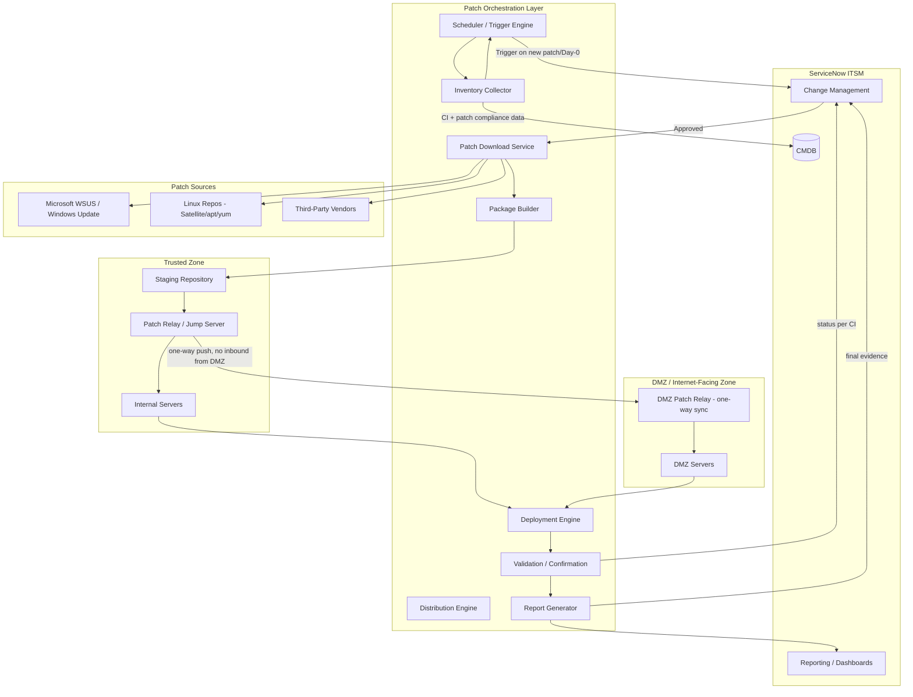
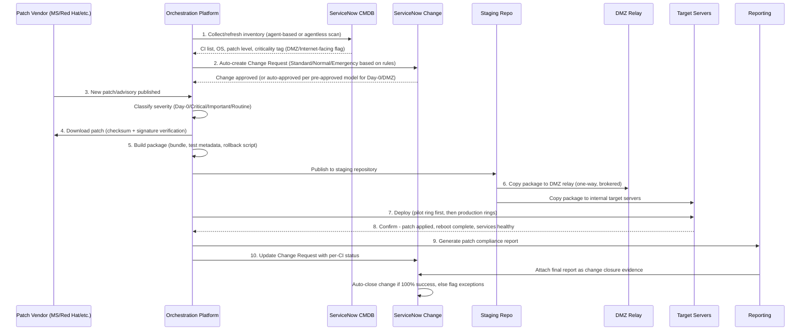
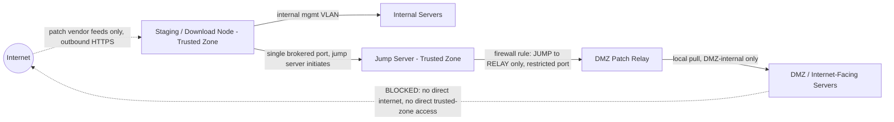

# Automated Patch Management Solution
## Enterprise Architecture — End-to-End Patching with ServiceNow ITSM Integration

---

## 1. Executive Summary

This document defines an end-to-end automated patching solution covering inventory collection, ServiceNow change submission, patch acquisition, packaging, distribution, deployment, validation, and reporting — with ServiceNow updated at every stage.

The design gives special treatment to **DMZ / Internet-facing servers**, which carry the highest exposure risk. For these systems, **Day-0 (critical/zero-day) vendor patches must be fully deployed within 3 calendar days of public release**, which requires an expedited change model, pre-staged approvals, and a segmented distribution path that respects DMZ network isolation.

The solution is tool-agnostic at the orchestration layer (works with Ansible Automation Platform, Microsoft Configuration Manager/WSUS, Azure Update Manager, or Red Hat Satellite as the underlying patch engine) but is opinionated about **workflow, control points, and ServiceNow integration pattern**, which is where most patching programs actually fail in practice.

---

## 2. Current State & Assumptions

Since no environment discovery was provided, this design assumes a typical hybrid enterprise estate and calls out where assumptions would need validation:

| Area | Assumption | Validate During Discovery |
|---|---|---|
| Estate | Mixed Windows Server + Linux (RHEL/Ubuntu), on-prem + cloud (Azure/AWS) | Confirm OS mix, count, cloud vs on-prem split |
| DMZ | Physically/logically segmented network, no direct inbound internet management access | Confirm firewall zones, jump host availability |
| CMDB | ServiceNow CMDB exists but may be incomplete/stale | Data quality audit required before go-live |
| Change process | Standard/Normal/Emergency change types exist in ServiceNow | Confirm current change model, approval matrix |
| Patch sources | Microsoft WSUS/Windows Update, vendor repos (Red Hat Satellite, apt), third-party (Java, Chrome, etc.) | Confirm which sources are in scope |
| Maintenance windows | Defined per environment/business unit | Confirm windows, blackout periods |
| Credentials | Centralized secrets vault available (CyberArk/Azure Key Vault/HashiCorp Vault) | Confirm vaulting solution in place |

---

## 3. Recommended Architecture

### 3.1 High-Level Component View

### 3.2 Why This Shape

- **ServiceNow is the system of record for approval and status, never the execution engine.** The orchestration layer (Ansible/SCCM/Azure Update Manager) does the actual work and reports state back via REST API. This avoids turning ServiceNow into a fragile execution engine and keeps audit trail clean.
- **DMZ never initiates a pull from the trusted zone or the internet directly.** A DMZ patch relay receives packages via a one-way, firewall-brokered push from a jump server in the trusted zone. This preserves the "no direct internet access from DMZ management plane" control that most security teams mandate.
- **Inventory drives everything.** You cannot patch, scope a change, or report accurately without accurate CI-level inventory reconciled against CMDB first.

---

## 4. End-to-End Workflow

### 4.1 Step-by-Step Detail

**Step 1 — Inventory Collection**
- Agent-based (SCCM client / Ansible facts / Azure Arc agent) or agentless (WinRM/SSH scan) sweep, scheduled daily and on-demand before every patch cycle.
- Reconciles discovered CIs against ServiceNow CMDB; flags drift (unmanaged/rogue servers) as a separate exception queue.
- Tags every CI with `network_zone` (DMZ / Internal / Cloud) and `internet_facing = true/false` — this attribute drives the entire SLA logic downstream.
- Captures current patch level, OS build, reboot-pending state.

**Step 2 — ServiceNow Change Submission**
- Orchestration platform calls ServiceNow Table API / Flow Designer action to auto-create a Change Request per patch cycle, pre-populated with:
  - Affected CI list (pulled from Step 1)
  - Patch/KB details, CVE references, severity
  - Proposed maintenance window
  - Risk assessment (auto-scored: Internet-facing = higher risk weight)
- **Change model varies by patch class** (see Section 4.2) — this is the key control that makes the 3-day DMZ SLA achievable without breaking governance.

**Step 3-5 — Download & Package**
- Download from authoritative source only (WSUS upstream sync, Red Hat Satellite sync, vendor-signed feeds).
- Verify checksum/digital signature before use — never deploy an unverified binary.
- Build a deployment package containing: the patch, a pre-check script, the install command, a post-check/validation script, and an automated rollback script.
- Package versioning and immutability: every package gets a unique ID logged against the Change Request.

**Step 6 — Copy to Target / DMZ Relay**
- Internal servers: package pulled from staging repo over standard management VLAN.
- DMZ servers: package pushed by a jump server across a tightly scoped firewall rule (single port, single direction, source/destination IP restricted) to a **DMZ-resident relay/staging node**. DMZ servers then pull locally from the relay — they never reach out to the internet or the internal trusted zone directly.

**Step 7 — Deploy**
- Ring-based rollout: Pilot/Canary → Non-Prod → Prod (non-DMZ) → DMZ/Internet-facing (or DMZ first if the vulnerability is actively exploited — decide per advisory).
- Pre-checks (disk space, pending reboot, dependent service state) run automatically; deployment aborts and flags exception if pre-checks fail.
- Maintenance-window aware: deployment engine only executes within the approved window from the Change Request.

**Step 8 — Confirm**
- Post-deployment validation: patch/KB presence check, service health check, application smoke test (where defined), reboot confirmation.
- Any failure triggers automatic rollback attempt, then escalation if rollback also fails.

**Step 9 — Generate Report**
- Per-cycle compliance report: % patched, list of exceptions, time-to-patch metrics, SLA adherence (especially DMZ 3-day metric).
- Delivered as a dashboard (Power BI / ServiceNow Performance Analytics) and as a document attached to the Change Request.

**Step 10 — Update ServiceNow Change**
- Orchestration platform updates the Change Request work notes / custom fields in near-real-time as each stage completes (not just at the end) — see Section 4.3.
- Final state: Change auto-closes as **Successful** if 100% compliant within SLA, or moves to **Successful with Issues** with exception CIs itemized, or **Unsuccessful** with rollback evidence.

### 4.2 Change Model by Patch Classification

| Patch Class | Definition | Change Type | Approval Model | Target SLA |
|---|---|---|---|---|
| Day-0 / Actively Exploited | Zero-day, actively exploited in the wild, vendor emergency advisory | Emergency Change (pre-approved template) | CAB notified, not blocking — Emergency Change Manager approves within hours | **DMZ: 3 days from release. Internal: 7 days** |
| Critical (CVSS 9+) | Critical severity, not yet actively exploited | Expedited Standard Change (pre-approved template, auto-scheduled) | Auto-approved against pre-agreed criteria; CAB informed | DMZ: 7 days. Internal: 14 days |
| Important (CVSS 7-8.9) | High severity, routine urgency | Standard Change | Auto-approved via template | 30 days (next standard cycle) |
| Routine / Low | Monthly patch Tuesday, low-severity | Standard Change | Auto-approved via template | Next monthly maintenance window |

> **Key governance point:** the "Emergency Change, pre-approved template" model is what makes a 3-day DMZ SLA realistic. If every Day-0 patch has to wait for a live CAB meeting, you will miss the SLA almost every time. The template is pre-approved once by the CAB/security leadership; each invocation is a **notification with veto rights**, not a request for permission.

### 4.3 ServiceNow Change Record — Field/State Update Pattern

Recommend extending the standard Change Request table with custom fields (or a related "Patch Deployment" child record per CI) so the record tells the full story without digging through work notes:

| Field | Example Value | Updated At |
|---|---|---|
| `u_patch_classification` | Day-0 / Critical / Important / Routine | Change creation |
| `u_cve_reference` | CVE-2026-XXXXX | Change creation |
| `u_network_zone` | DMZ / Internal / Cloud | Change creation |
| `u_sla_deadline` | Auto-calculated: release date + 3 days (DMZ Day-0) | Change creation |
| `u_download_status` | Completed / Failed | After Step 4 |
| `u_package_status` | Built / Verified | After Step 5 |
| `u_deployment_status` | Not Started / In Progress / Completed / Failed | Live during Step 7 |
| `u_ci_success_count` / `u_ci_failure_count` | 47/50 | After Step 8 |
| `u_sla_met` | Yes / No / At Risk | Continuously recalculated |
| `close_notes` | Auto-generated summary + link to report | After Step 10 |

Integration is via ServiceNow **REST Table API** (or **IntegrationHub / Orchestration spokes** if you want low-code) called from the orchestration platform's post-job webhook — not a ServiceNow-side scheduled pull, since push-on-event keeps the record current within seconds of each stage completing.

---

## 5. Alternative Options — Orchestration Engine Choice

| Option | Strengths | Weaknesses | Best Fit |
|---|---|---|---|
| **Ansible Automation Platform (AAP)** | Agentless (SSH/WinRM), strong ServiceNow certified integration (Change/CMDB), cross-OS, good for hybrid + DMZ relay pattern via `bastion`/execution nodes | Requires playbook development effort, licensing cost at scale | Recommended default for mixed Windows/Linux + hybrid cloud estates |
| **Microsoft Configuration Manager (SCCM/MECM) + WSUS** | Native for large Windows estates, mature software distribution, well-understood by most enterprise ops teams | Windows-centric (Linux needs a second tool), less natural DMZ relay model (needs a remote Distribution Point in DMZ with careful hardening) | Windows-heavy on-prem estates already invested in SCCM |
| **Azure Update Manager (+ Arc for on-prem/multi-cloud)** | SaaS-delivered, native Azure/Arc integration, good for cloud-first estates, built-in scheduling and reporting | Less mature ServiceNow-native integration (needs Logic Apps/Azure Functions bridge), less control over air-gapped DMZ patterns | Azure/Arc-centric hybrid estates |
| **Red Hat Satellite + Ansible** | Best-in-class for RHEL-heavy estates, content views give strong Day-0 patch staging control | Linux-only; still needs a Windows-side tool alongside it | Linux/RHEL-dominant estates |

**Recommendation:** Ansible Automation Platform as the orchestration and deployment layer (cross-platform, strong ServiceNow certified content collection), with SCCM/WSUS and Red Hat Satellite/Foreman as the underlying patch-source/distribution mechanisms it drives for Windows and Linux respectively. This gives one control plane and one ServiceNow integration pattern regardless of OS.

---

## 6. Security & Compliance

- **Package integrity:** every downloaded patch is verified against vendor checksum/digital signature before it enters the staging repository. Reject and alert on mismatch — never deploy an unverified binary.
- **DMZ network control:** the DMZ relay accepts inbound only from the designated jump server, on a single restricted port, with mutual TLS or signed package transfer. DMZ servers have **no outbound internet access** for patching — they always pull from the DMZ-local relay.
- **Least privilege service accounts:** orchestration platform uses scoped service accounts per zone (one for internal, a separate, more tightly scoped one for DMZ) stored in a secrets vault (CyberArk/Azure Key Vault/HashiCorp Vault) with just-in-time credential checkout, not static stored passwords.
- **Segregation of duties:** the account that approves the Change in ServiceNow is never the same account that executes the deployment — enforced via role-based access in both ServiceNow and the orchestration platform.
- **Immutable audit trail:** every package build, deployment run, and validation result is logged with timestamp, operator/service account, and CI list, and referenced back to the Change Request number for full ITIL traceability.
- **Compliance mapping:** this workflow directly supports audit evidence for PCI-DSS (Req. 6.3.3/11.3), ISO 27001 (A.12.6.1), and NIST 800-53 (SI-2) patch management controls — the ServiceNow Change record + attached report becomes your audit artifact per patch cycle.

---

## 7. Network & Connectivity

Firewall rule summary:

| Source | Destination | Port/Protocol | Direction | Purpose |
|---|---|---|---|---|
| Staging/Download Node | Internet (vendor CDNs only, allow-listed) | 443/HTTPS | Outbound only | Patch acquisition |
| Jump Server (Trusted) | DMZ Relay | Restricted (e.g., 445/SSH-only, package transfer) | One-way, Trusted→DMZ | Package delivery |
| DMZ Servers | DMZ Relay | Local mgmt port | Internal to DMZ only | Patch pull/install |
| DMZ Servers | Internet | — | **Explicitly blocked** | Prevent direct patching bypass and reduce attack surface |
| Orchestration Platform | ServiceNow instance | 443/HTTPS (REST API) | Outbound only | Change/CMDB updates |

Bandwidth/latency note: for large patch bundles (e.g., cumulative Windows updates, 500MB-2GB), stage once centrally and fan out locally per zone rather than re-downloading per server — this matters especially for DMZ relay sizing and for remote/branch sites on constrained links.

---

## 8. Operations & Monitoring

- **Real-time dashboard** (Power BI or ServiceNow Performance Analytics) showing: patch compliance % by zone, SLA countdown timers for open Day-0/Critical changes, exception list with owner and reason.
- **Alerting:** automated alert (Teams/Slack/email + ServiceNow notification) when a DMZ Day-0 change is within 24 hours of its 3-day SLA deadline and not yet 100% deployed.
- **Exception handling workflow:** any CI that fails deployment or validation automatically spins off an Incident linked to the parent Change, assigned to the CI owner, with the failure log attached — it does not silently sit in a spreadsheet.
- **Weekly/Monthly patch compliance report** to security leadership, split by zone, with trend of mean-time-to-patch for DMZ vs internal.
- **Drift detection:** daily inventory re-scan compares against the "should be patched by" list from CMDB and flags any server that fell out of compliance post-deployment (e.g., due to being offline during the window).

---

## 9. Risks & Mitigations

| Risk | Impact | Mitigation |
|---|---|---|
| DMZ 3-day SLA missed due to CAB delay | Extended exposure window on internet-facing assets | Pre-approved Emergency Change template; CAB notified not gated |
| Patch breaks application/service on Internet-facing server | Outage on customer-facing system | Mandatory pilot/canary ring even for Day-0 (compress to hours, not days); automated rollback script bundled in every package |
| Stale/incomplete CMDB misses a DMZ server entirely | Unpatched server sits exposed, invisible to the process | Daily inventory reconciliation with drift/exception queue reviewed by ops daily |
| Credential compromise on jump server used for DMZ push | Lateral movement path into DMZ | Just-in-time vaulted credentials, MFA on jump server, single-purpose hardened host, session recording |
| Package tampering in transit or at rest | Supply-chain style compromise | Signature/checksum verification at every hop (download, staging, DMZ relay) |
| Reboot-required patches during business hours on Internet-facing systems | Availability impact | Rolling/canary deployment across redundant server pairs; drain load balancer before patch, re-add after validation |

---

## 10. Cost & Licensing Considerations

- **Ansible Automation Platform**: subscription per managed node (or per-core for controller); factor in execution environment nodes for DMZ (may need a dedicated execution node/bastion inside or adjacent to DMZ).
- **ServiceNow**: confirm existing ITOM/ITSM license tier supports Table API + Flow Designer/IntegrationHub actions used here; Performance Analytics module needed for the compliance dashboards if not already licensed.
- **WSUS/SCCM**: typically already licensed under existing Microsoft EA if Windows Server estate is in scope — incremental cost is mainly DMZ Distribution Point hardware/VM if a new one is required.
- **Secrets management**: if not already in place, CyberArk/HashiCorp Vault licensing is a new line item — this is not optional given the DMZ credential handling requirement.
- **One-time cost:** playbook/automation development effort (typically the largest cost driver, more than licensing) — budget for a phased build (Section 11) rather than a single big-bang implementation.

---

## 11. Implementation Roadmap

| Phase | Duration | Scope |
|---|---|---|
| **Phase 0 — Discovery & CMDB Cleanup** | 2-4 weeks | Validate assumptions in Section 2, reconcile CMDB, tag all CIs with network_zone/internet_facing attributes |
| **Phase 1 — Foundation** | 4-6 weeks | Stand up orchestration platform, staging repo, DMZ relay + firewall rules, secrets vault integration |
| **Phase 2 — ServiceNow Integration** | 3-4 weeks | Build Change templates (Emergency/Standard pre-approved), REST API integration, custom fields, dashboards |
| **Phase 3 — Pilot** | 4 weeks | Run full workflow on a non-critical server ring (internal only), tune pre/post-checks and rollback logic |
| **Phase 4 — DMZ Rollout** | 3-4 weeks | Extend to DMZ ring with the 3-day Day-0 SLA process live, run a tabletop drill on a real or simulated Day-0 advisory |
| **Phase 5 — Full Production & Optimization** | Ongoing | Expand to full estate, refine SLA dashboards, quarterly review of change model effectiveness |

---

## 12. Best Practices / Operational Checklist

- [ ] Every DMZ/Internet-facing CI is explicitly flagged in CMDB — no implicit assumptions about zone
- [ ] Emergency Change template is pre-approved by CAB/security leadership **before** the first Day-0 event, not during one
- [ ] Canary/pilot ring always runs first, even under SLA pressure — compress the timeline, don't skip the step
- [ ] Rollback script is mandatory in every package, tested in pilot before it ever reaches DMZ
- [ ] DMZ never has direct outbound internet access for patching — always via relay
- [ ] ServiceNow Change record updates happen per-stage (event-driven), not just at closure
- [ ] SLA countdown (3-day DMZ Day-0) is visible on a dashboard with automated escalation, not tracked manually
- [ ] Post-patch validation includes an application/service health check, not just "patch installed" confirmation
- [ ] Monthly compliance report goes to security leadership regardless of whether there was a Day-0 event that month

---

## 13. Final Recommendation

Adopt **Ansible Automation Platform** as the single cross-platform orchestration layer, driving native tools (WSUS/SCCM for Windows, Satellite/Foreman for Linux) for actual patch sourcing, with a **DMZ-resident relay node** fed by a one-way, tightly firewalled push from a hardened jump server. Integrate with ServiceNow via REST API using a **pre-approved Emergency Change template** for Day-0/Critical patches — this is the single most important governance decision, since it is what makes a 3-day DMZ SLA achievable without either bypassing change control or missing the deadline waiting for a live CAB.

Sequence the rollout to prove the workflow on internal, lower-risk servers first (Phase 3), then extend to DMZ once pre/post-checks and rollback logic are proven (Phase 4) — do not pilot new automation directly against Internet-facing production systems.
